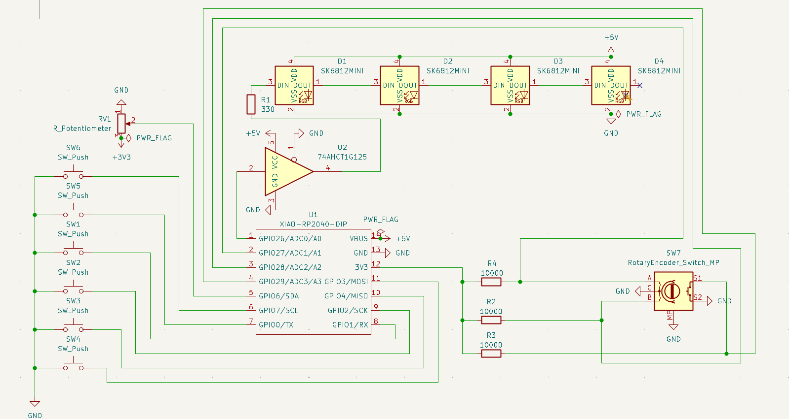
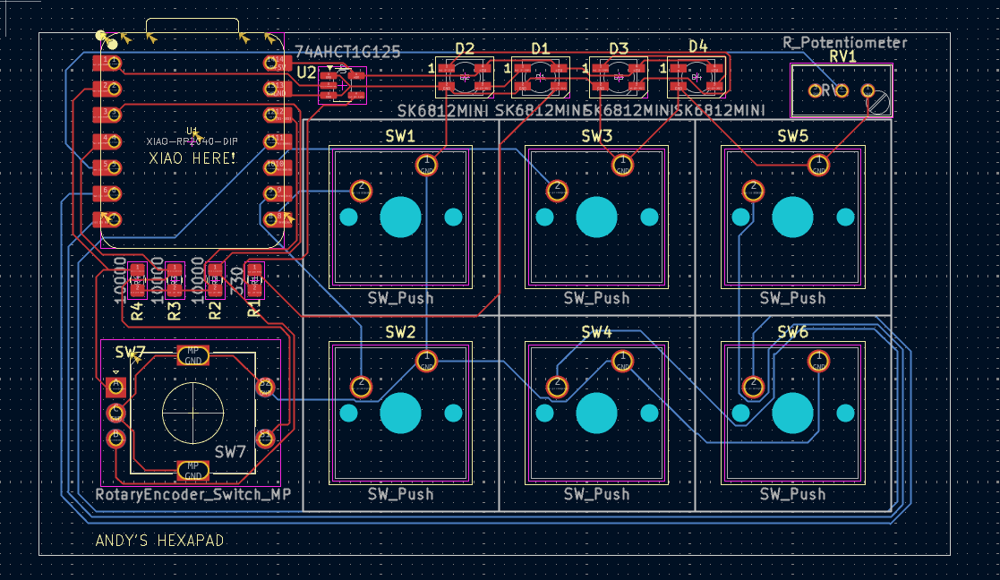
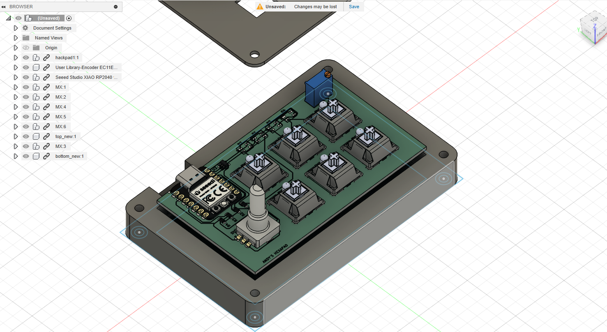
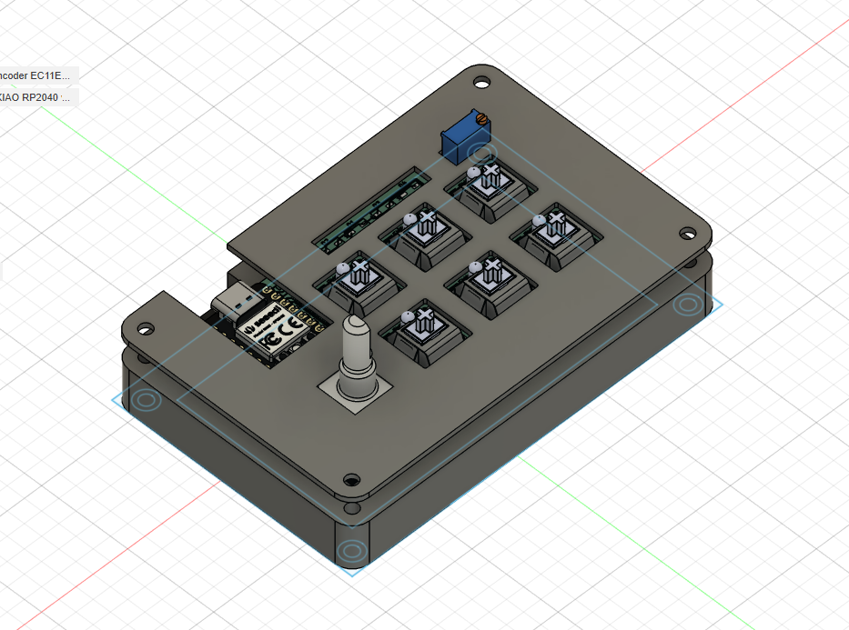

# Macropad
---

## Bill of Materials (BOM)

| Reference(s) | Qty | Value / Part | Footprint (KiCad lib) | Datasheet / Link |
|--------------|-----|--------------|-----------------------|------------------|
| D1–D4        | 4   | SK6812 Mini RGB LED | LED_SMD:LED_SK6812MINI_PLCC4_3.5x3.5mm_P1.75mm | <https://cdn-shop.adafruit.com/product-files/2686/SK6812MINI_REV.01-1-2.pdf> |
| R1           | 1   | 330 Ω resistor | Resistor_SMD:R_0805_2012Metric_Pad1.20x1.40mm_HandSolder | – |
| R2–R4        | 3   | 10 kΩ resistor | Resistor_SMD:R_0805_2012Metric_Pad1.20x1.40mm_HandSolder | – |
| RV1          | 1   | 10 kΩ trimmer pot (Bourns 3296W) | Potentiometer_THT:Potentiometer_Bourns_3296W_Vertical | – |
| SW1–SW6      | 6   | MX-compatible mechanical key switch | Button_Switch_Keyboard:SW_Cherry_MX_1.00u_PCB | – |
| SW7          | 1   | EC11 rotary encoder with push switch | Rotary_Encoder:RotaryEncoder_Alps_EC11E-Switch_Vertical_H20mm | – |
| U1           | 1   | Seeed XIAO RP2040 (DIP) | OPL:XIAO-RP2040-DIP | – |
| U2           | 1   | 74AHCT1G125 level-shifting buffer (SOT-23-5) | Package_TO_SOT_SMD:SOT-23-5_HandSoldering | <http://www.ti.com/lit/sg/scyt129e/scyt129e.pdf> |

---

## 📸 Images

  
  

