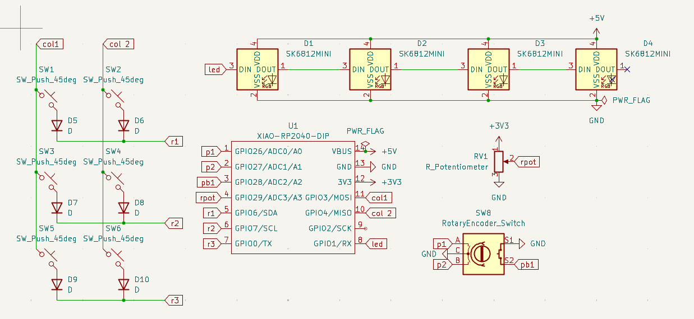
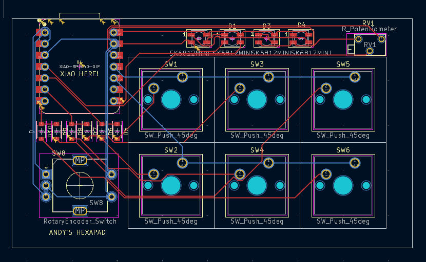
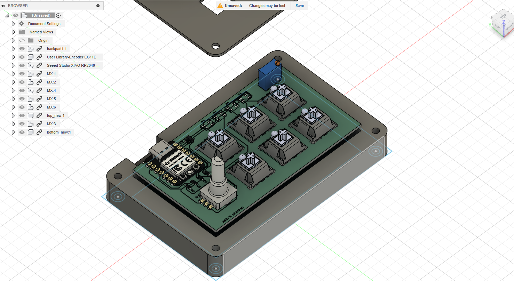
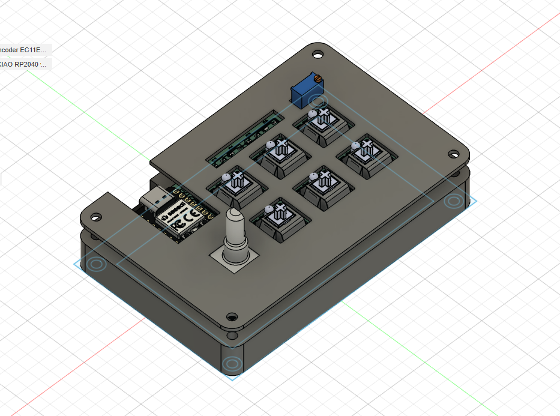

# Macropad
---

# Bill of Materials (BOM)

| Component | Qty | Link |
|-----------|-----|------|
| SK6812-MINI RGB LED | 4 |
| Switching Diode (e.g., 1N4148) | 6 |
| 10 kΩ Trimmer Potentiometer | 1 | [https://www.switchelectronics.co.uk/products/10k-3296-variable-potentiometer-trimmer?variant=45366121595189&_gsid=a7fdeEfvG3t] |
| Cherry MX Key Switch | 6 |
| Rotary Encoder | 1 |
| Seeed XIAO-RP2040 Board | 1 |

---

## 📸 Images

  
  

